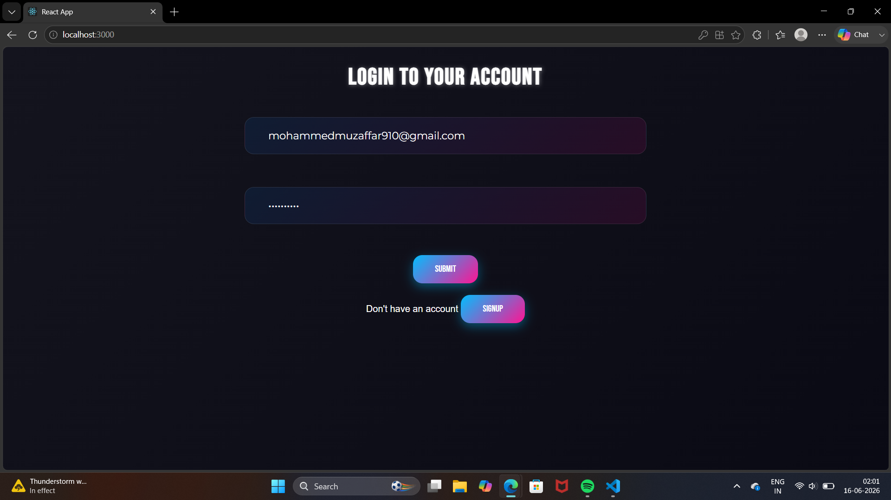
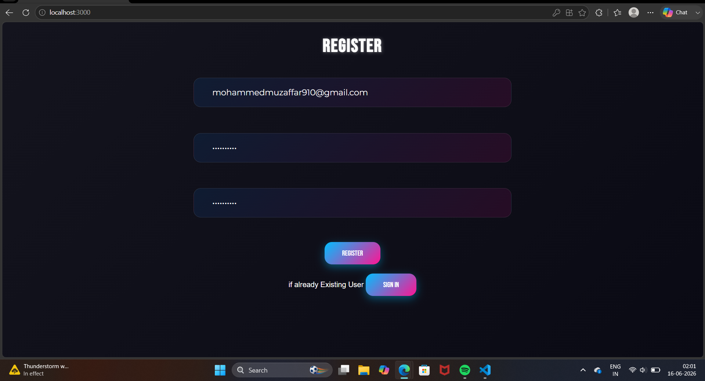
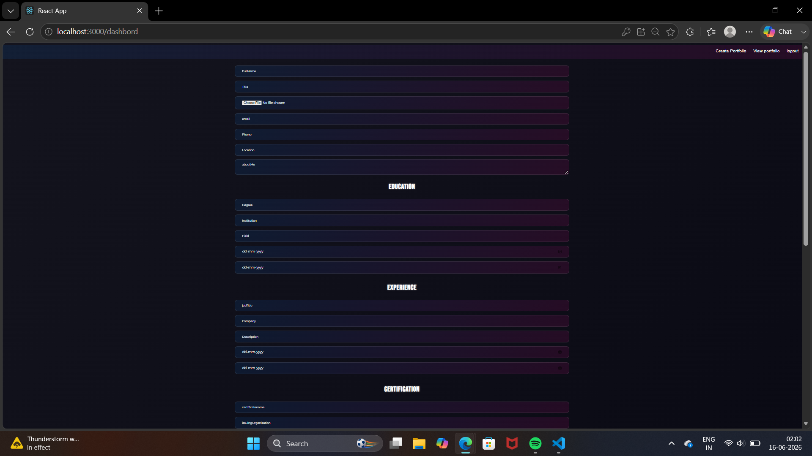
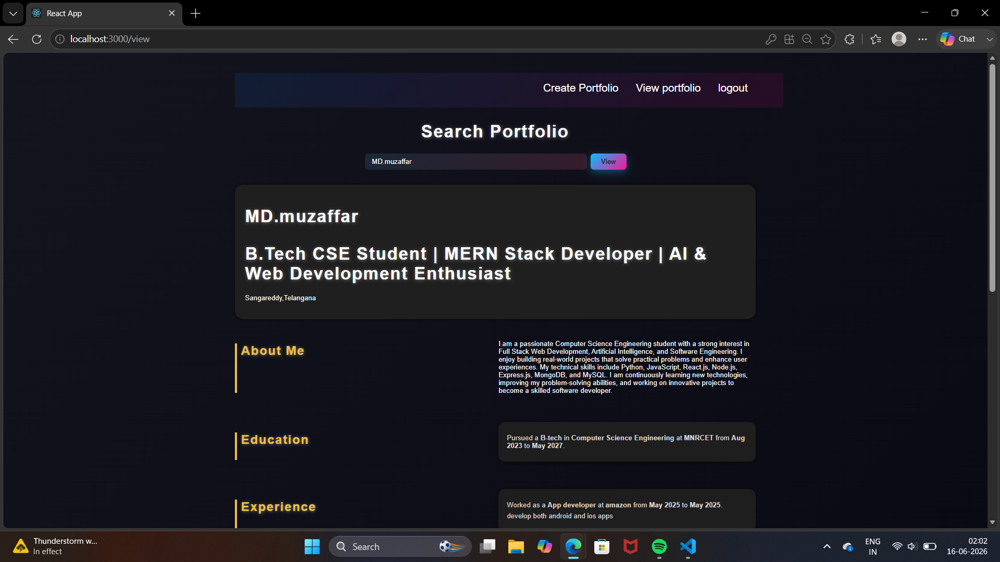

# 🚀 Portfolio Builder

A full-stack web application that enables users to create, manage, and showcase professional portfolios through a centralized platform. Users can organize their education, experience, certifications, skills, projects, blogs, and contact information in one place.

---

## 📌 Features

### Authentication

* User Registration
* User Login
* Secure Authentication System

### Portfolio Management

* Create and Manage Professional Portfolios
* Update Portfolio Information
* Dynamic Portfolio Viewing

### Portfolio Sections

* About Me
* Education
* Work Experience
* Certifications
* Skills
* Languages
* Projects Showcase
* Blog Section
* Contact Information

### User Experience

* Responsive User Interface
* Easy-to-Use Forms
* Structured Portfolio Layout

---

## 🛠️ Tech Stack

### Frontend

* React.js
* CSS

### Backend

* Node.js
* Express.js

### Database

* MongoDB

### Tools

* Git
* GitHub
* VS Code

---

## 📂 Project Structure

```text
Portfolio-Builder
│
├── backend
│   ├── server.js
│   ├── package.json
│
├── frontend
│   └── my-app
│       ├── src
│       ├── public
│       └── package.json
│
├── screenshots
│   ├── login.png
│   ├── register.png
│   ├── create-portfolio.png
│   └── view-portfolio.png
│
└── README.md
```

---

## 📸 Screenshots

### Login Page



### Register Page



### Create Portfolio



### View Portfolio



---

## ⚙️ Installation

### Clone Repository

```bash
git clone https://github.com/mohdmuzaffar9/Portfolio-Builder.git
```

### Backend Setup

```bash
cd backend
npm install
npm start
```

### Frontend Setup

```bash
cd frontend/my-app
npm install
npm start
```

Application will run at:

```text
Frontend: http://localhost:3000
Backend: http://localhost:5000
```

---

## 🎯 Future Enhancements

* Multiple Portfolio Templates
* Portfolio Theme Customization
* Resume Download Feature
* Portfolio Sharing Options
* Public Portfolio URLs
* PDF Export Functionality

---

## 👨‍💻 Author

**Mohammed Muzaffar**

B.Tech Computer Science Student

Full Stack Developer | React.js | Node.js | MongoDB | Django

GitHub: https://github.com/mohdmuzaffar9
